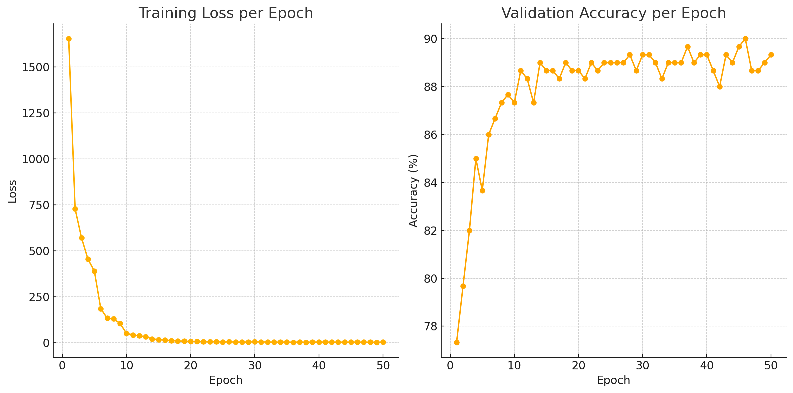

## NYCU Computer Vision 2025 Spring HW1  
Student ID: 110550124     
Name: 林家甫     

## Introduction 
The core idea of this homework is to use the RasNet-Based machine learning model to classify pictures into 100 categories. The training dataset contains 21,024 images, while the validation dataset contains 2,344 images. I use ResNeXT 50 implement this homework.     

## How to install 
Main Packages   
Dataset Link: https://drive.google.com/file/d/1fx4Z6xl5b6r4UFkBrn5l0oPEIagZxQ5u/view?usp=drive_link     
Pytorch: https://pytorch.org/     
Anaconda: https://www.anaconda.com/docs/getting-started/anaconda/install     

## Peformance Snapshot 
